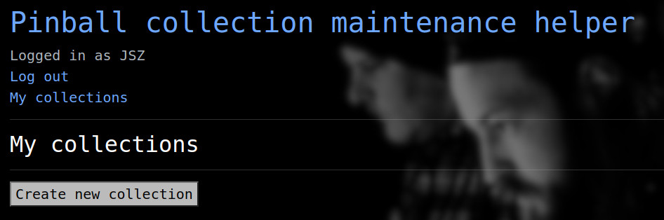
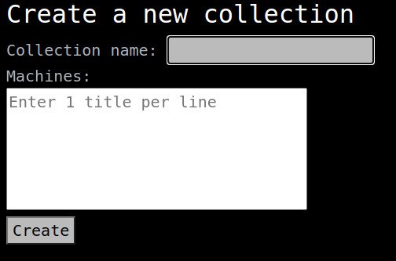
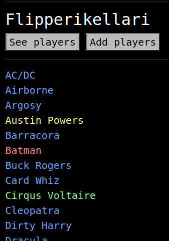
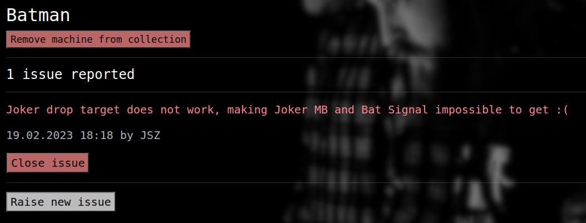

# Pinball collection maintenance helper

###### Python / Flask / PostgreSQL project for the Spring 2023 course "Tietokantasovellus", University of Helsinki

### What and why:
In the pinball community it is not unusual to see collections of [several dozen machines](http://www.flipperikellari.fi/flipperit/). Pinball machines have a lot of ways to malfunction and especially with a large collection that sees a lot of players, some kind of system for keeping track of these is very helpful. This app aims to make it easy
* for a player (who is not necessarily the owner of the machine) to report a malfunction
* for the owner (or some other designated person) to see the reported malfunctions

Owners should create their collection and other players should (after registering to the app) ask the owner to give them user or admin rights. For now there is no way to ask in-app as it is assumed that the owner is also physically attending at their collection and in face to face interaction with other players.

#### The app has the following features:  

* All users log in with a username and password
* A user can create a new collection which makes them an admin with regard to that collection
* An admin can edit the collection afterwards
* An admin can add other players to use their collection. They can be added either as normal users or as admins
* Any user can report a malfunction. The report always concerns a certain machine and includes a written description of what is wrong
* The malfunction is given a severity rating from 1 (not severe, e.g. a light that is not working) to 3 (very severe, e.g. an important feature of the game is impossible to achieve because a mechanical switch not working)
* When looking at reported malfunctions the user sees who reported it and when
* An admin can mark a malfunction as fixed (i.e. delete the entry)
* An admin can remove other users from their collection

#### Future improvement ideas:

* Could be nice to be able to include a photo when reporting a malfunction? But in almost all cases a written description should be enough to explain what is wrong
* For an operator (person who owns machines "on location" i.e. bars) it would be useful to make reporting malfunctions as easy as possible, preferably without any registration or other hassle. This could be achieved for example by attaching a unique QR code to each machine that would link directly to that machine's reporting form.
* Currently it is perhaps too easy to remove users from your collection, it only takes a single click in the user list view. On the other hand this should not be a feature that is needed very often. You can not remove yourself however so it should be impossible for a collection to become completely unattended

### Find it on Fly.io:
#### https://pcmh.fly.dev/  
**NB**: sometimes on first interaction you will get an OperationalError that I was unable to fix, seems like if the server has been idle this might be more likely to happen? Page refresh should get you back into normal operation. SQLAlchemy explanation of this error: https://sqlalche.me/e/14/e3q8

For testing purposes if you don't want to start from scratch, I have created a collection with a couple of users (please don't delete them from the collection..)  
User **JHQ**, password **jhqjhqjhq** is an admin.  
User **TestUser**, password **testuser** is a normal user.


### Using the app
After creating a user account you will see this:


Click the button to create a new collection. In this view you can name your collection and provide a list of machines it includes.  
  
After this you can navigate to your collection and machines. As admin you can also see who else is admin or normal user of the collection and add users when necessary. Game titles are color coded to reflect the maximum severity of their reported malfunctions.  
  
Here Batman has a serious malfunction, Austin Powers has a somewhat serious malfunction, and Cirqus Voltaire has a not serious malfunction. The machines in blue have no reported malfunctions.  
  
Sure enough it is pretty serious. Only admins see the red buttons. The blue collection name links back to the collection view.


#### How to install locally (if need be, fly seems to be working):
Clone the repository using your preferred method.  
Go to the root directory. Create a file called `.env` with the following contents (replacing the secret key value with an actual random string):
```
DATABASE_URL = postgresql://
SECRET_KEY = <your secret key here>
```
Launch a virtual environment:
```
python3 -m venv venv
source venv/bin/activate
```
Install required packages:
```
pip install -r requirements.txt
```
Launch your postgresql server. I do it by `start-pg.sh` but there may be other ways?

You probably want to create a new database in order to not mess with your existing one. You can do that by launching the interpreter: `psql` and using the command `CREATE DATABASE <your-database-name>;`

Build the database:
```
psql -d <your-database-name> < schema.sql
```
Launch the app:
```
flask run
```
